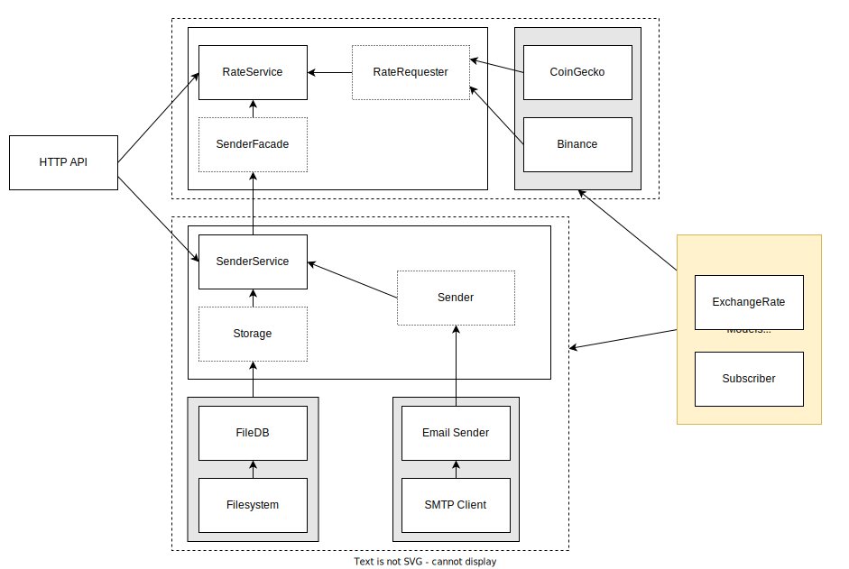

# SE'23 School Case Task
A simple Go http api, which allows to get a BTC to UAH exchange rate, and send it to subscribed emails

Made as a test task solution for the Software Engineering School 3.0

Also was my first experience with Go

## Task description
You need to implement a service with APIs that will allow you to:
- find out the current bitcoin (BTC) exchange rate in hryvnia (UAH);
- subscribe to an email to receive information on the exchange rate change;
- a request that will send all subscribed users the current rate.
- languages of the task: **PHP or Go**.

Additional requirements:
1. The service must comply with the described API. The API itself is described here in the form of swagger documentation. For convenient viewing, you can use the service https://editor.swagger.io/.
2. All data for the application must be stored in files (no need to connect the database). That is, you need to implement the storage and work with data (for example, email addresses) through the file system.
3. The repository must have a Dockerfile that allows you to run the system in Docker. You need to familiarize yourself with the material on Docker yourself.
4. The documentation must be followed in full, so you cannot change the contracts.
5. You can use relevant frameworks.
6. You can also add comments or a description of the logic of the work in the README.md document. The correct logic can be an advantage in the assessment if you do not complete the task.
You can use all the available information, but
complete the assignment on your own.

## Installation & Run
### Docker (preferable)
1. Build an image
    ```
    docker build -t bitcoin-rate-app . --progress=plain
    ```

2. Run a container (the app uses port 3333 by default)
    ```
    docker run --rm -p 3333:3333 bitcoin-rate-app
    ```

3. Configure app

    - Using CLI args
        ```
        docker run --rm -p 3333:3333 bitcoin-rate-app \
            --sender.smtpHost="0.0.0.0" \
            --sender.smtpPort="25" \
            --sender.from="user@example.com" \
            --sender.password=""  \
            --storage.filename="emails.dat" \
            --server.host="0.0.0.0" \
            --server.port="3333"
        ```
    - Using environmental variables
        ```
        docker run --rm -p 3333:3333 \
            -e BTCAPP_SENDER_SMTPHOST="0.0.0.0" \
            -e BTCAPP_SENDER_SMTPPORT="25" \
            -e BTCAPP_SENDER_FROM="user@example.com" \
            -e BTCAPP_SENDER_PASSWORD="" \
            -e BTCAPP_STORAGE_FILENAME="emails.dat" \
            -e BTCAPP_SERVER_HOST="0.0.0.0" \
            -e BTCAPP_SERVER_PORT="3333" \
            bitcoin-rate-app
        ```

    - Using a config file
        ```
        docker run --rm -v "`pwd`/configs/config.yaml":"/config.yaml" -p 3333:3333 bitcoin-rate-app
        ```
    You can combine different ways of configurations, priority will be the following:
    1. CLI
    2. ENV variables
    3. config file

### Without Docker
1. Compile an app
    ```
    make build
    ```
    or
    ```
    go build -o bin/bitcoin-rate-app ./cmd/bitcoin-rate-app
    ```
2. Run the binary
    ```
    bin/bitcoin-rate-app
    ```

3. Configure app

    - Using CLI args
        ```
        bin/bitcoin-rate-app \
            --sender.smtpHost="0.0.0.0" \
            --sender.smtpPort="25" \
            --sender.from="user@example.com" \
            --sender.password=""  \
            --storage.filename="emails.dat" \
            --server.host="0.0.0.0" \
            --server.port="3333"
        ```
    
    - Using environmental variables
        ```
        export BTCAPP_SENDER_SMTPHOST="0.0.0.0"
        export BTCAPP_SENDER_SMTPPORT="25"
        export BTCAPP_SENDER_FROM="user@example.com"
        export BTCAPP_SENDER_PASSWORD=""
        export BTCAPP_STORAGE_FILENAME="emails.dat"
        export BTCAPP_SERVER_HOST="0.0.0.0"
        export BTCAPP_SERVER_PORT="3333"

        bin/bitcoin-rate-app
        ```

    - Using a config file
        ```
        bin/bitcoin-rate-app --config configs/config.yaml
        ```
    You can combine different ways of configurations, priority will be the following:
    1. CLI
    2. ENV variables
    3. config file

### Development run
- Use
    ```
    make run
    ```
    or
    ```
    go run ./cmd/bitcoin-rate-app
    ```

## Configuration
Please see [`./configs/template_configs.yaml`](./configs/template_configs.yaml) for a list of all configurable parameters

## Usage
Documentation for the endpoints can be found in [`docs/`](./docs/) folder. Postman collection provided in [`test/`](./test/) directory as well

## Architecture


